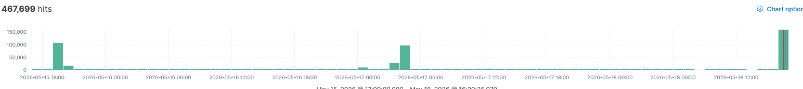
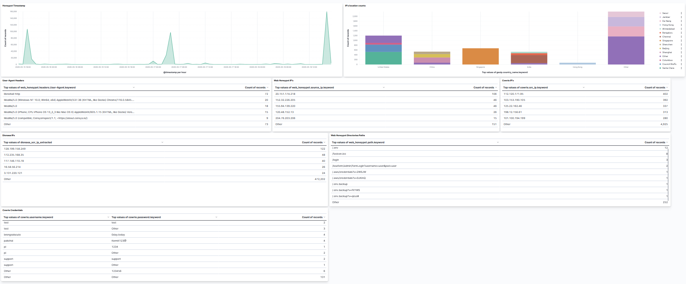

# Introducción

Para comprobar la cantidad de incidentes que podrían llegar a un honeypot por el simple hecho de existir en Internet, decidí mantenerlo encendido durante un fin de semana completo, y encontramos alguna curiosidad:

Llegó una cantidad de incidentes realmente abrumadora para solo haber permanecido activo durante un día y sin siquiera pertenecer a un sitio con alguna operatividad:

Para ello creé un pequeño dashboard para ver los datos que para este lab me parecieron más importantes: 

Aquí se puede observar varias cosas: 

# Análisis del Dashboard del Honeypot

## Volumen de actividad por servicio
El dato más llamativo es la diferencia brutal entre servicios. Dionaea acumula 528.341 registros frente a los apenas 410 de web y 123 de Cowrie. Esto indica que los atacantes están focalizando sus esfuerzos en los protocolos de red que monitoriza Dionaea (SMB, FTP, HTTP, MySQL, entre otros) más que en SSH. Es un patrón típico de bots automatizados que escanean puertos en busca de servicios vulnerables conocidos, especialmente SMB que históricamente ha sido muy explotado con vulnerabilidades como EternalBlue.

## Origen de los ataques por país
Que Países Bajos lidere con un 37% es muy significativo. Países Bajos es conocido por albergar grandes proveedores de hosting y VPS baratos que los atacantes usan habitualmente para lanzar campañas desde IPs europeas, intentando evadir ciertos filtros geográficos. Lo mismo ocurre con Estados Unidos y Canadá, donde el tráfico probablemente proviene de servidores cloud alquilados, no de usuarios reales de esos países.

## IPs más activas
La IP 204.76.203.206 destaca enormemente con casi el 37% de todo el tráfico ella sola. Esto apunta a un escáner automatizado o bot muy agresivo que está atacando de forma persistente. Sería recomendable investigarla en bases de datos de reputación como AbuseIPDB o Shodan para ver si está catalogada como maliciosa.
La IP 20.220.233.65 pertenece al rango de Microsoft Azure, lo que confirma que los atacantes están usando infraestructura cloud legítima para lanzar sus ataques, una técnica cada vez más común para evitar ser bloqueados.

## Análisis temporal — Los tres picos de actividad
Estos picos no son aleatorios. El hecho de que aparezcan en intervalos aproximados de 5-6 horas sugiere que hay un escáner automatizado con un ciclo programado, no un ataque humano manual. Entre picos la actividad baja a 2-5/s, que sería el ruido de fondo habitual de internet.
El tercer pico a las 06:00 de la mañana es especialmente llamativo porque coincide con el horario en que muchos administradores de sistemas no están monitorizando activamente, una táctica habitual para intentar pasar desapercibido.

## Conclusiones generales
Se ve principalmente actividad automatizada y masiva orientada a encontrar servicios vulnerables en red, no ataques dirigidos específicamente al honeypot. Los puntos más destacables son:
En primer lugar, el volumen de Dionaea indica que los bots están escaneando puertos típicos de malware como SMB (445), MySQL (3306) y FTP (21), buscando exploits conocidos.
En segundo lugar, la concentración de tráfico en una sola IP (36.83%) es una señal de alerta que merece investigación inmediata en bases de datos de reputación.
En tercer lugar, el patrón cíclico de los picos confirma que es actividad automatizada con intervalos programados, probablemente parte de una campaña de escaneo masivo de internet.
Por último, el uso de infraestructura cloud (Azure, AWS) por parte de los atacantes es una tendencia moderna para evitar listas negras de IPs residenciales o de hosting barato.

Habiendo obtenido toda esta información, lo más recomendable ahora mismo sería añadir otra visualización sobre los puertos atacados ya que dionaea es el servicio más atacado con una increíble diferencia frente al resto, y poder analizar con más detalle que puertos intentan explotar los atacantes.

Después investigaremos la IP 204.76.203.206 para ver si esta catalogada como maliciosa.

# Creación de la visualización  
