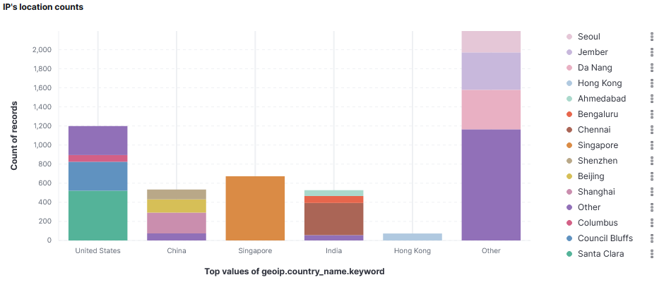
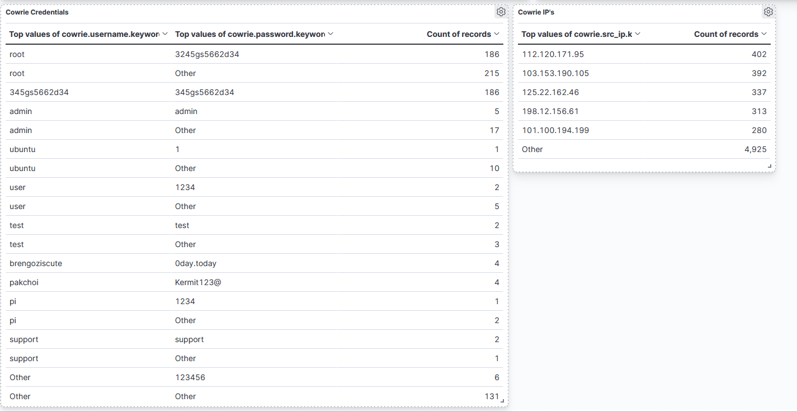
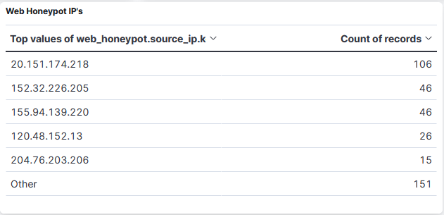
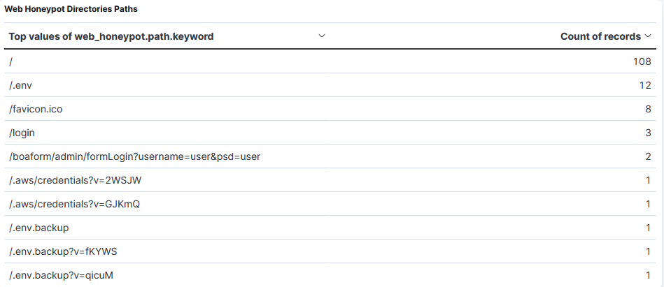
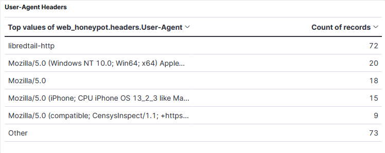
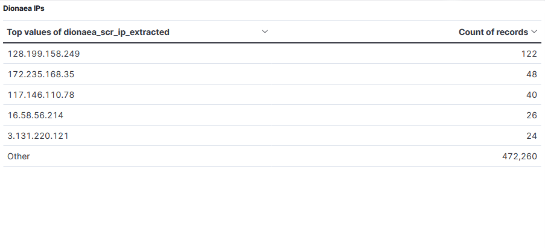

# HoneyCloud SIEM — Informe de Actividad

## Introducción

Para comprobar la cantidad de incidentes que podrían llegar a un honeypot por el simple hecho de existir en Internet, decidí mantenerlo encendido durante un fin de semana completo, y encontramos alguna curiosidad:

Llegó una cantidad de incidentes realmente abrumadora para solo haber permanecido activo durante un fin de semana y sin siquiera pertenecer a un sitio con alguna operatividad.

## Período de análisis

**Fecha:** 15 de mayo 2026 — 18 de mayo 2026 (fin de semana)

**Infraestructura desplegada:**

- Cowrie (SSH honeypot) — Puerto 22
- Dionaea (malware honeypot) — Puertos 21, 445, 3306, 1433
- Web Honeypot — Puerto 80
- ELK SIEM para monitorización centralizada

**Dashboard**

---

## Resumen ejecutivo

Durante el fin de semana de exposición, el honeypot registró un volumen masivo de actividad maliciosa automatizada. Se observó un pico de más de 160.000 eventos por hora durante la madrugada del 16 de mayo, lo que indica la presencia de botnets y escáneres masivos. Los ataques provinieron de más de 20 países, siendo Estados Unidos, China, Singapur, India y Hong Kong los principales orígenes. Se detectaron intentos de acceso con credenciales por defecto, escaneo de rutas sensibles en el servidor web y conexiones a servicios vulnerables simulados por Dionaea.

---

## Análisis temporal

El gráfico de actividad muestra un patrón claro:

- **15 de mayo (viernes):** Actividad alta desde el primer momento de exposición, con picos de más de 100.000 eventos por hora. Esto corresponde al descubrimiento inicial del honeypot por parte de escáneres automatizados como Censys y Shodan.
- **16 de mayo (sábado):** Se registró el pico máximo de actividad superando los **160.000 eventos/hora** en la madrugada. A lo largo del día la actividad fue descendiendo progresivamente.
- **17 de mayo (domingo):** Actividad considerablemente reducida con un pequeño repunte durante la noche, sugiriendo escaneos programados.
- **18 de mayo (lunes):** Actividad mínima residual.

Este patrón es típico de un nuevo servicio expuesto a internet: los escáneres masivos lo descubren en las primeras horas, generan un pico inicial de reconocimiento, y posteriormente los ataques se normalizan a un flujo constante más bajo.

---

## Análisis geográfico

### Distribución por países

| País | Eventos aproximados | Observaciones |
|------|--------------------:|---------------|
| Estados Unidos | ~1.200 | Principal origen, incluye servicios cloud (AWS, Azure) |
| China | ~1.150 | Segundo mayor origen, concentrado en Beijing, Shanghai y Shenzhen |
| Singapur | ~800 | Importante nodo de tráfico en Asia-Pacífico |
| India | ~600 | Distribuido entre Ahmedabad, Bengaluru y Chennai |
| Hong Kong | ~400 | Hub de tráfico asiático |  

### Ciudades más activas

Las ciudades de origen incluyen Seoul, Jember (Indonesia), Da Nang (Vietnam), Hong Kong, Ahmedabad, Bengaluru, Chennai, Singapur, Shenzhen, Beijing, Shanghai, Columbus (EEUU), Council Bluffs (EEUU) y Santa Clara (EEUU).

La presencia de ciudades como Council Bluffs y Santa Clara es significativa, ya que son ubicaciones de centros de datos de Google y AWS respectivamente, lo que indica que muchos ataques se originan desde infraestructura cloud comprometida o alquilada por atacantes.

---

## Análisis de ataques SSH (Cowrie)

### IPs más activas

| IP | Intentos | Observaciones |
|----|--------:|---------------|
| 112.120.171.95 | 402 | Atacante más persistente |
| 103.153.190.105 | 392 | Actividad sostenida |
| 125.22.162.46 | 337 | Probable botnet |
| 198.12.156.61 | 313 | IP de hosting |
| 101.100.194.199 | 280 | — |
| Otras | 4.925 | Gran volumen distribuido |

**Total de eventos SSH: ~6.649**

El alto número de IPs únicas con cientos de intentos cada una indica la presencia de botnets de fuerza bruta que realizan ataques de credential stuffing de forma distribuida.

### Credenciales más utilizadas

| Usuario | Contraseña | Intentos | Análisis |
|---------|-----------|--------:|----------|
| root | 3245gs5662d34 | 186 | Contraseña de una botnet específica (Mirai variante) |
| 345gs5662d34 | 345gs5662d34 | 186 | Mismo patrón, usuario=contraseña |
| root | (varias) | 215 | Fuerza bruta clásica contra root |
| admin | admin | 5 | Credenciales por defecto |
| ubuntu | (varias) | 11 | Targeting de servidores Ubuntu |
| test | test | 4 | Credenciales de prueba |
| user | 1234 | 2 | Contraseñas débiles comunes |
| brengoziscute | 0day.today | 4 | Referencia a la comunidad de exploits 0day.today |
| pakchoi | Kermit123@ | 4 | Credencial de botnet IoT |
| pi | 1234 | 1 | Targeting de Raspberry Pi |
| support | support | 2 | Credenciales de soporte por defecto |
| (varios) | 123456 | 6 | Contraseña más común del mundo |  

**Hallazgos clave:**

- La combinación root/3245gs5662d34 con 186 intentos indica una campaña coordinada de botnet que usa credenciales hardcodeadas, probablemente una variante de Mirai o similar.
- El usuario brengoziscute con contraseña 0day.today sugiere atacantes vinculados a la comunidad de compraventa de exploits.
- El targeting de pi (Raspberry Pi) y ubuntu muestra que los atacantes buscan activamente dispositivos IoT y servidores cloud.
- Las combinaciones admin/admin, test/test y support/support son ataques oportunistas buscando credenciales por defecto.

---

## Análisis de ataques Web (Web Honeypot)

### IPs más activas

| IP | Peticiones | Observaciones |
|----|----------:|---------------|
| 20.151.174.218 | 106 | Rango de Microsoft Azure |
| 152.32.226.205 | 46 | — |
| 155.94.139.220 | 46 | — |
| 120.48.152.13 | 26 | — |
| 204.76.203.206 | 15 | — |  

### Rutas más escaneadas

| Ruta | Peticiones | Tipo de ataque |
|------|----------:|----------------|
| `/.env` | 12 | Búsqueda de archivos de configuración con credenciales |
| `/favicon.ico` | 8 | Reconocimiento / fingerprinting |
| `/login` | 3 | Búsqueda de paneles de administración |
| `/boaform/admin/formLogin?username=user&psd=user` | 2 | Exploit de routers Boa (CVE conocido) |
| `/.aws/credentials?v=2WSJW` | 1 | Intento de robo de credenciales AWS |
| `/.aws/credentials?v=GJKmQ` | 1 | Intento de robo de credenciales AWS |
| `/.env.backup` | 1 | Búsqueda de backups de configuración |
| `/.env.backup?v=fKYWS` | 1 | Variante con cache-busting |  

**Hallazgos clave:**

- El ataque más frecuente fue la búsqueda de archivos .env, que en frameworks como Laravel o Node.js contienen credenciales de base de datos, claves API y secretos. Este es actualmente uno de los vectores de ataque más comunes en la web.
- Los intentos de acceso a /.aws/credentials son particularmente peligrosos: buscan archivos de credenciales de Amazon Web Services que podrían dar acceso completo a la infraestructura cloud de la víctima.
- El ataque a /boaform/admin/formLogin explota una vulnerabilidad conocida en servidores web Boa, comúnmente usado en routers y dispositivos IoT.
- La presencia de /.env.backup indica atacantes sofisticados que saben que los administradores a veces renombran archivos sensibles en vez de eliminarlos.

### User-Agents detectados

| User-Agent | Peticiones | Tipo |
|-----------|----------:|------|
| libredtail-http | 72 | Bot automatizado de escaneo |
| Mozilla/5.0 (Windows NT 10.0) | 20 | Navegador simulado |
| Mozilla/5.0 | 18 | User-Agent genérico (bot) |
| Mozilla/5.0 (iPhone) | 15 | Simulando dispositivo móvil |
| CensysInspect/1.1 | 9 | Escáner legítimo de Censys |

El User-Agent más frecuente, libredtail-http, es una herramienta de escaneo automatizado. La presencia de CensysInspect confirma que escáneres legítimos de seguridad también indexaron el honeypot, lo cual es esperado.  

---

## Análisis de ataques a servicios (Dionaea)

### IPs más activas

| IP | Conexiones | Observaciones |
|----|----------:|---------------|
| 128.199.158.249 | 122 | DigitalOcean — posible servidor comprometido |
| 172.235.168.35 | 48 | Linode/Akamai |
| 117.146.110.78 | 40 | China Mobile |
| 16.58.56.214 | 26 | Amazon AWS |
| 3.131.220.121 | 24 | Amazon AWS |
| Otras | 472.202 | Volumen masivo de escaneo |

**Total de eventos Dionaea: ~472.462**

El volumen extraordinariamente alto de eventos en Dionaea (más de 472.000) se debe principalmente a escaneos automatizados de puertos SMB (445), MySQL (3306) y FTP (21). La mayoría son bots que escanean rangos de IP completos buscando servicios vulnerables.

Los orígenes en DigitalOcean, Linode y AWS sugieren servidores cloud comprometidos que se usan como plataformas de lanzamiento de ataques.  

---

## Conclusiones

1. **La exposición a internet es inmediata y agresiva.** En cuestión de minutos tras el despliegue, el honeypot comenzó a recibir ataques automatizados. Esto demuestra que cualquier servicio expuesto a internet sin protección adecuada será descubierto y atacado rápidamente.

2. **Los ataques son predominantemente automatizados.** La gran mayoría del tráfico proviene de botnets y escáneres automáticos, no de atacantes humanos. Esto se evidencia por las credenciales hardcodeadas, los User-Agents de bots y el volumen masivo de intentos.

3. **Las credenciales por defecto siguen siendo un vector crítico.** Combinaciones como root/admin, admin/admin, test/test y pi/1234 se intentaron repetidamente, lo que confirma que los dispositivos con credenciales por defecto son objetivos fáciles.

4. **Los atacantes buscan activamente credenciales cloud.** Los intentos de acceso a /.aws/credentials y /.env demuestran que los atacantes modernos priorizan el robo de credenciales de servicios cloud sobre la compromisión directa de servidores.

5. **La infraestructura cloud se usa como plataforma de ataque.** Muchas IPs atacantes pertenecen a proveedores como AWS, DigitalOcean y Linode, lo que indica que los atacantes utilizan servidores cloud (propios o comprometidos) para lanzar sus campañas.
